# MaintOps

**AI-powered handyman matching and incident management on Databricks.** A client describes a household problem in
plain words to **Manny**, the AI assistant. Manny logs the incident, ranks the three best-suited handymen by skills,
track record, reviews, workload and real travel time, and assigns the client's choice. The handyman sets off, works,
and records the hours and the amount paid. The client's rating flows back into the rankings within a minute.

**Live app: https://maintops-h3bv.onrender.com** · all demo accounts use the password `MaintOps!2026`

| | |
|---|---|
| Scale | 1,000,000-incident history (Spark, Delta), 110,000 users and 10,000 handymen with PDF CVs, 44,800 live incidents in Lakebase |
| Agent | 13 tools (5 write), every write confirmed by the user first; released only through an automated gate: **71 scenarios × 3 runs, ~2,100 checks in code, any failure blocks the release** |
| Real time | a review → the handyman's scorecard back in Lakebase: **37.1 s for a burst of 1,000 reviews**, median 32.7 s in normal operation |
| Unstructured | 10,000 CV PDFs parsed (100 %), FAQ retrieval hit@3 = 12/12, review sentiment and summaries with AI functions |
| Quality | 281 unit tests, lint clean, every measurement in [`evidence/`](evidence/) regenerated from the live systems by one script |

---

## Contents

1. [For instructors: try it in five minutes](#for-instructors-try-it-in-five-minutes)
2. [Rubric map: requirement → implementation → evidence](#rubric-map)
3. [The app in pictures](#the-app-in-pictures)
4. [What MaintOps does](#what-maintops-does)
5. [Architecture](#architecture)
6. [Manny, the action-taking agent](#manny-the-action-taking-agent)
7. [Matching handymen](#matching-handymen)
8. [Lakebase data model](#lakebase-data-model)
9. [Spark pipelines: batch and real time](#spark-pipelines-batch-and-real-time)
10. [Analytics pipeline](#analytics-pipeline)
11. [Third-party API: Geoapify](#third-party-api-geoapify)
12. [Run it yourself](#run-it-yourself)
13. [Full manual test walkthrough](#full-manual-test-walkthrough)
14. [Repository layout](#repository-layout)
15. [Known limitations and future work](#known-limitations-and-future-work)
16. [Appendix: design specification](#appendix-design-specification)

---

## For instructors: try it in five minutes

Open **https://maintops-h3bv.onrender.com** (free Render instance: the first request after a quiet period takes up to
50 s while it wakes up). Password for every account: `MaintOps!2026`.

| Account | Role | Try this |
|---|---|---|
| *(logged out)* | visitor | Chat bubble (bottom right) → "Can I choose the handyman myself?" → Manny answers from the user guide |
| `thomaskoch37@example.com` | client | Tell Manny "My kitchen tap is leaking" → incident logged, 3 ranked handymen as cards (€/h, travel by car or public transport) → **Choose** → confirm → assigned; the dashboard updates without a reload |
| `ute.wisniewski15@example.net` | handyman with a car | Job #981034: **I'm on my way** (from home, by car or public transport) → **Start job** → **Mark completed** with 2.5 h and €135 |
| `sergejhartmann66@example.com` | client | #981034 shows Ute's expected arrival, then her 2.5 h · €135.00; rate the job |
| `nina.mayer79@example.org` | handyman without a car | Ask Manny "Job 632296 is finished." → it asks for the hours and the amount, repeats them and saves only after "Yes" |
| `bernd.wolf@example.net` | client | "Rate job 744760 5 stars" → when asked to confirm: "Yes, but make it 3 stars" → Manny notices the change and asks again |

Sign-up with a CV: Sign up → Handyman → upload a CV PDF (sample in the repo: [samples/cv_100001.pdf](samples/cv_100001.pdf), a synthetic CV)
→ name, phone, address, region and specialisations are filled in.

> **If Manny answers "not available right now"**: the web app calls Manny's serving endpoint with a Databricks token,
> and student accounts in this workspace can only obtain 1-hour tokens (personal access tokens are disabled). Everything
> else keeps working. A workspace admin can set a longer one in two minutes, see
> [Databricks access for the web app](#databricks-access-for-the-web-app-for-the-workspace-admin).

The longer walkthrough, covering every feature, is [below](#full-manual-test-walkthrough).

---

## Rubric map

Every claim links to code or to an exported measurement in [`evidence/`](evidence/) (regenerate with
`python evidence/export_evidence.py`).

| Criterion (points) | What is built | Evidence |
|---|---|---|
| **Spark data pipeline** (15) | Job `maintops_pipeline`: raw JSON export with injected defects → Auto Loader bronze → silver with **18 validation rules** and a quarantine table with reason codes → gold scorecards (success rate, rating, resolution time, **hourly rate from billed jobs**), review sentiment (`ai_analyze_sentiment`) and summaries (`ai_query`) → upsert to Lakebase. Idempotent: checkpoints, MERGE, caches, `force=true` rebuilds; every step logs counts and checks, a failed check stops the job. | [evidence/pipeline.md](evidence/pipeline.md): 1,004,842 raw → **979,490 valid + 20,510 quarantined** (8 reasons), all checks passed; code [pipeline/](pipeline/), logic in [pipeline_lib.py](pipeline/pipeline_lib.py) |
| **Third-party API** (10) | Geoapify geocoding (sign-up, CV, profile), Route Matrix (handymen with a car) and Routing API public transport (handymen without one). Key from env/secret scope, retries with backoff on 429/5xx (`Retry-After`), response validation, a flagged fallback estimate, every call logged | [maintops_core/geo.py](maintops_core/geo.py), unit tests with mocked HTTP in [tests/](tests/); [evidence/analytics.md](evidence/analytics.md): 1,949 calls, 0 failures in routing |
| **Lakebase data model** (15) | 7 tables: users, handyman details, incidents, trips, app events, two scorecard tables. PK/FK everywhere, **30 CHECK constraints**, triggers (`updated_at`, handyman role), 21 indexes, duplicate-incident guard, audit timestamps; 6 idempotent migrations with a dry-run mode | [evidence/lakebase.md](evidence/lakebase.md) (exported from `pg_catalog`), [sqls/](sqls/) |
| **Agent: retrieval** (6) | 8 read tools over Lakebase, Vector Search (FAQ) and the Spark-built scorecards; `find_handymen` combines Lakebase, Delta-derived features and Geoapify | [Manny](#manny-the-action-taking-agent), [agent/manny.py](agent/manny.py) |
| **Agent: write actions** (8) | 5 write tools: create incident, assign handyman, cancel, rate, update job status (with hours and amount). Identity from the server only, explicit confirmation before every consequential write, a guard that refuses a write when the user's "yes" changes a detail, validation in the service layer and the database | [evidence/analytics.md](evidence/analytics.md) (write actions), [evidence/agent.md](evidence/agent.md) (refusals by rule) |
| **Agent: quality** (6) | Release gate: 71 multi-turn scenarios × 3, checks are code (database state, tool arguments, every figure grounded in data the user may see, figures attributed to the right handyman, the top pick is the top-ranked candidate, confirmation before writes, emergencies, injection). Runtime guards: grounded numbers, mixed-up figures, phone numbers, emergency advice | [evidence/agent.md](evidence/agent.md): every gate run, including the ones that blocked a release; [eval/](eval/) |
| **Analytics pipeline** (10) | Lakebase **Change Data Feed** → Lakeflow **Declarative Pipeline** `maintops_analytics` (2 streaming tables, 9 materialized views, expectations), refreshed every 30 min | [evidence/analytics.md](evidence/analytics.md), [pipeline/analytics/](pipeline/analytics/) |
| **Frontend and workflow** (10) | Role-specific dashboards, chat widget with candidate cards and "Choose", live dashboard updates, confirmations, loading and error states, CV sign-up, trips with ETA, ratings | [screenshots](#the-app-in-pictures), [walkthrough](#full-manual-test-walkthrough), [templates/](templates/) |
| **Deployment** (5) | Render, auto-deploy on push, health check, secrets in the dashboard; Databricks side as one Asset Bundle | https://maintops-h3bv.onrender.com, [render.yaml](render.yaml), [databricks.yml](databricks.yml), [Run it yourself](#run-it-yourself) |
| **Big Data: Volume** | 1,000,000 incidents through the distributed pipeline, clustered Delta tables | [evidence/pipeline.md](evidence/pipeline.md) |
| **Big Data: Velocity** | Structured Streaming on Lakebase CDF, checkpointed, latency measured per batch | [evidence/latency.md](evidence/latency.md): burst of 1,000 reviews in **37.1 s**, 93.7 % of normal batches fully under 60 s |
| **Big Data: Variety** | 10,000 CV PDFs → `ai_parse_document` → profile fields; FAQ PDF → chunks → embeddings → Vector Search; review texts → sentiment and summaries | [evidence/variety.md](evidence/variety.md): 10,000/10,000 parsed, hit@3 = 12/12 |

---

## The app in pictures

Captured on 3 October 2026 with headless Chrome from the deployed code (same templates, Lakebase data and production
Manny endpoint), following the walkthrough below.

| | |
|---|---|
| **Client reports a problem:** Manny logs the incident and explains its top pick; the cards show match, track record, travel by car or public transport and the hourly rate<br>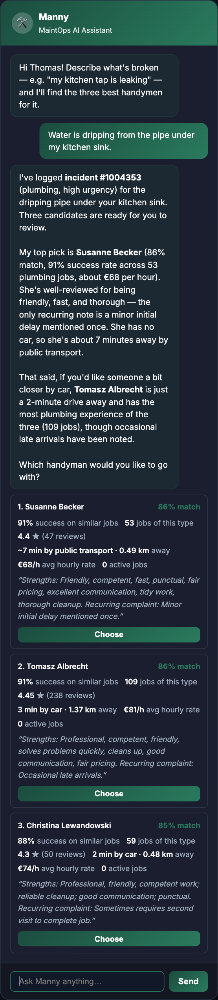 | **"Choose" → assigned:** the incident list updates without a page reload<br>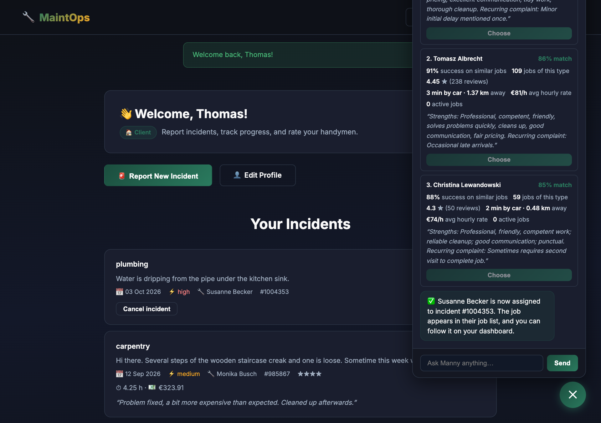 |
| **Handyman dashboard:** performance, feedback insights, "I'm on my way" (car or public transport) and completion with hours and amount<br>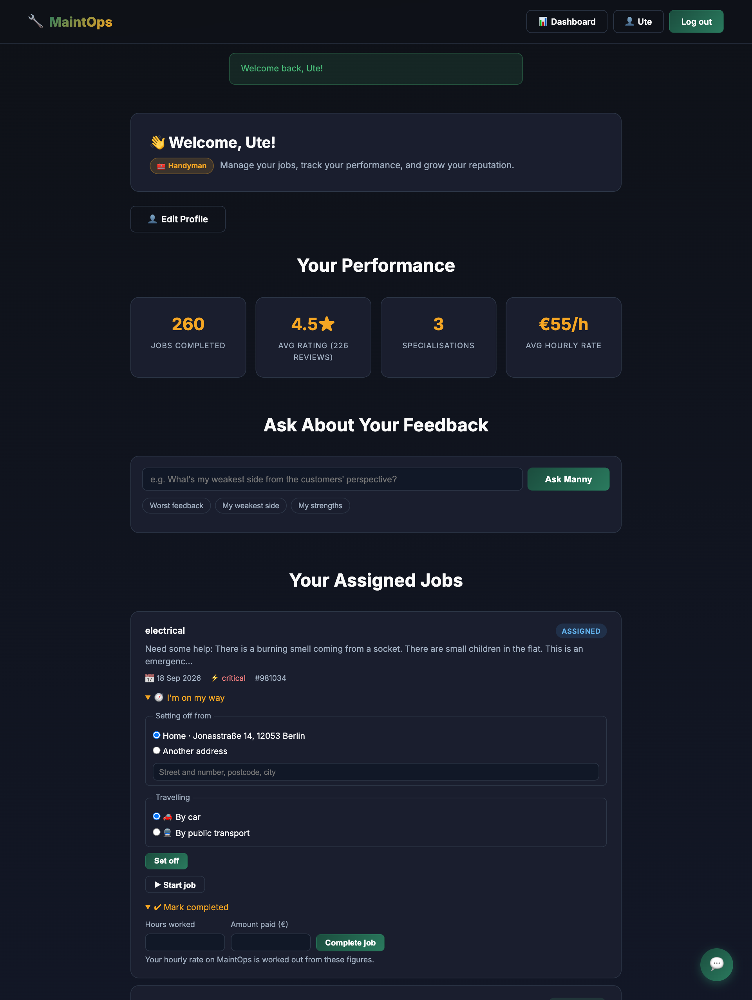 | **Completing through Manny:** it asks for the hours and the amount before anything is saved<br>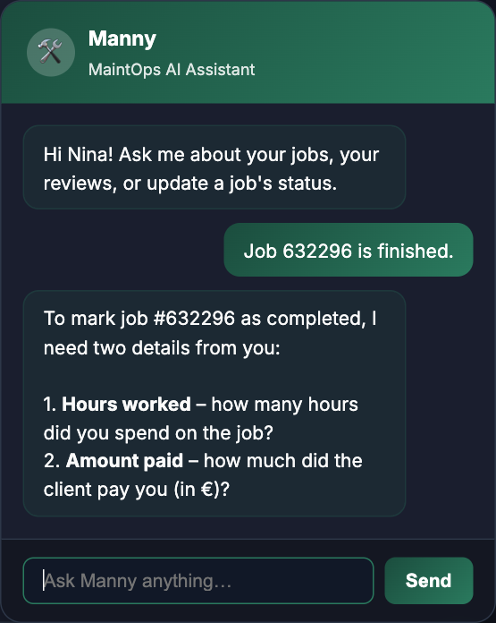 |
| **Feedback insights:** the worst-rated jobs and the recurring complaint<br>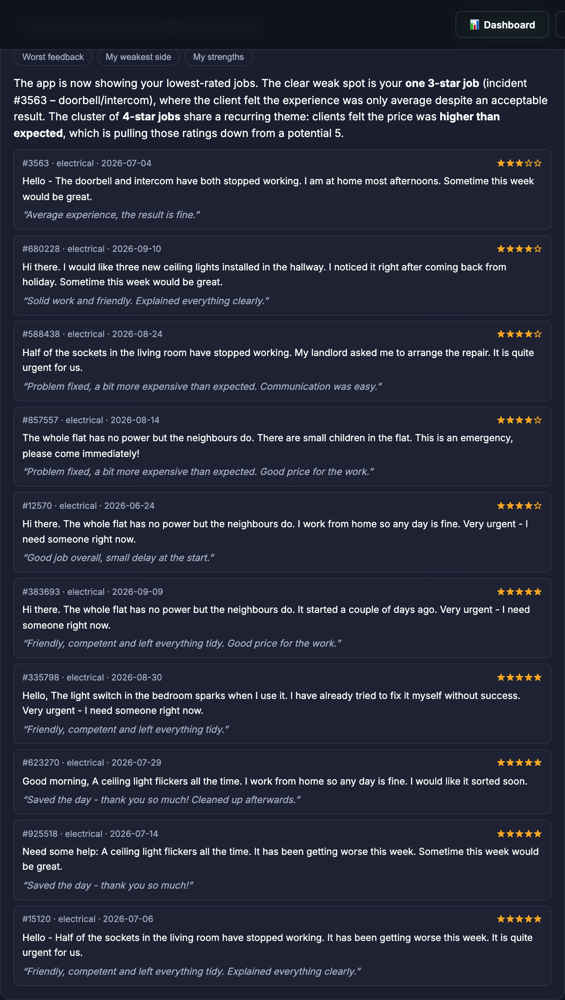 | **Sign-up with a CV:** name, phone, address, region, country, specialisations and skills filled in from the PDF<br>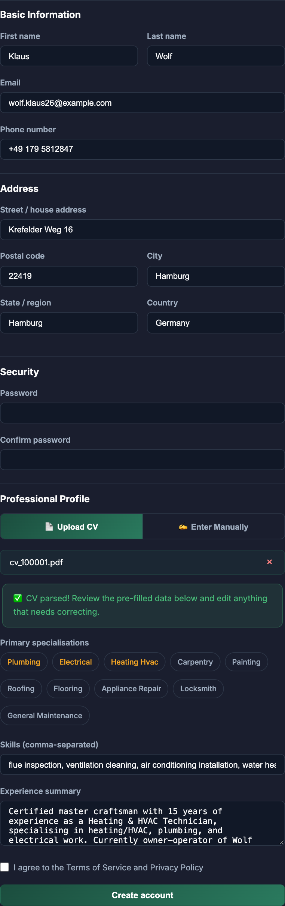 |
| **Visitor question:** answered from the user guide (RAG)<br>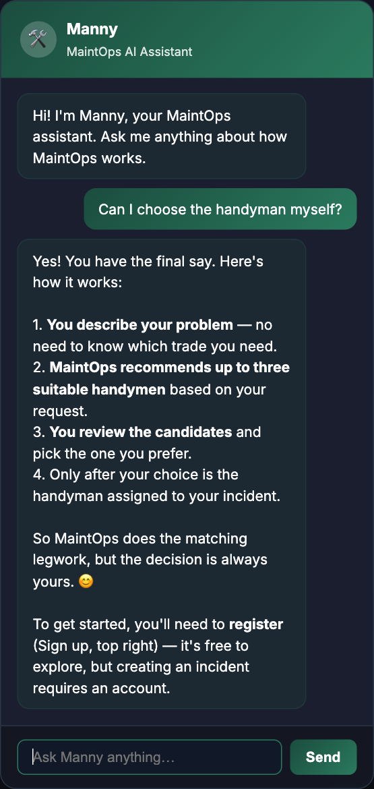 | **Landing page**<br>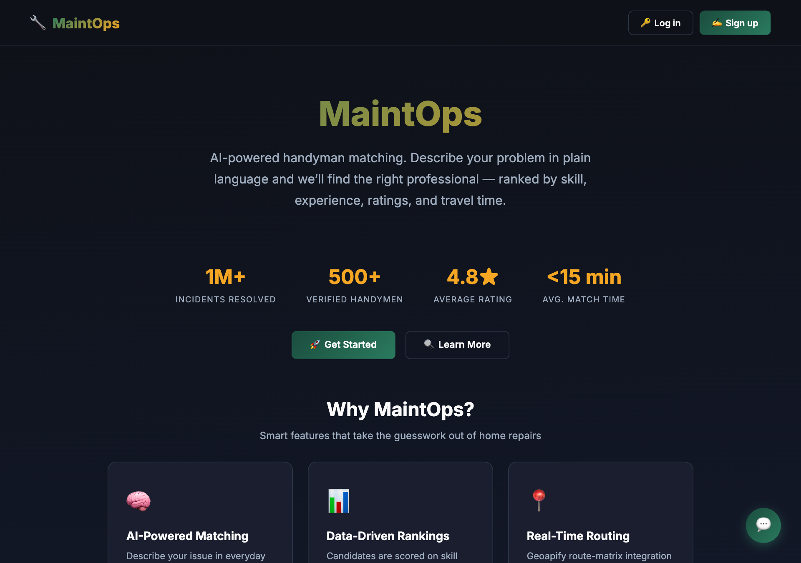 |

---

## What MaintOps does

**The problem.** Finding a reliable handyman fast is guesswork: who is qualified for *this* problem, who is good at
it, who is free, and who can actually get here soon? MaintOps answers that from data, and keeps the client in control
of the choice.

**The core loop**

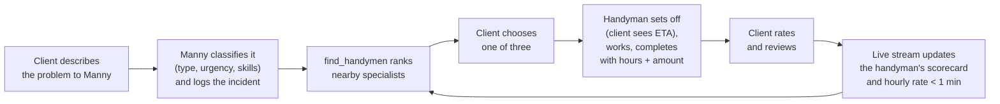

**Product rules (built into the code, not the prompt):** the LLM only understands language; ranking, distances,
prices and every write are deterministic code. The client always makes the final choice. Nothing is written without
the user's explicit "yes". MaintOps is not an emergency service: for gas, fire, flooding or electrical danger Manny
first tells the user to call 112.

**Every feature, by user**

- **Visitor:** landing page, Manny answers questions from the user guide (RAG), sign-up as client or handyman.
- **Client:** report a problem in plain words; see three ranked handymen with match %, success on similar jobs,
  rating, travel time by car or public transport, hourly rate and a review summary; choose one (cards or chat);
  follow the handyman's trip ("set off at 14:05 · ~28 min by public transport · expected around 14:33"); cancel;
  see hours and amount paid; rate and review; the dashboard updates live after each action.
- **Handyman:** sign up with a CV (fields filled in from the PDF); dashboard with jobs completed, rating and hourly
  rate; job list by urgency; "I'm on my way" (from home, the last job or another address; car or public transport
  if they have a car); start and complete jobs with hours and amount; ask Manny about their feedback ("worst
  reviews", "weakest side") and get the pattern plus one practical tip.

---

## Architecture

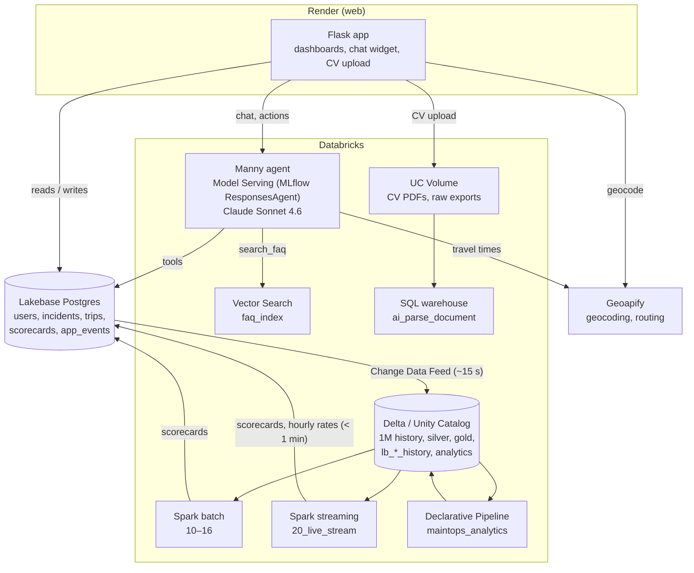

| Layer | Technology |
|---|---|
| Web app | Flask, Flask-Login, Flask-WTF (CSRF), Argon2id passwords, gunicorn on Render |
| Agent | MLflow `ResponsesAgent` registered in Unity Catalog (`bootcamp_students.maintops.manny`), served with `agents.deploy`, tracing and inference table; LLM `databricks-claude-sonnet-4-6` |
| Operational store | Lakebase (Postgres), autoscaling 0.5–2 CU, connection pool with pre-ping |
| Change data | Lakebase Change Data Feed → `lb_*_history` Delta tables |
| Pipelines | Spark (Auto Loader, Delta MERGE, Structured Streaming), AI functions, Lakeflow Declarative Pipelines |
| Retrieval | Vector Search endpoint `maintops_vs`, embeddings `databricks-gte-large-en` |
| Deployment | Databricks Asset Bundle (all jobs and the pipeline), Render (web) |

---

## Manny, the action-taking agent

One agent (`agent/manny.py`) does all AI work: visitor questions, the client's incidents, the handyman's jobs and CV
extraction at sign-up. The server decides the user's role and id; the browser cannot change them.

| Role | Read tools | Write tools |
|---|---|---|
| Visitor | `search_faq` (Vector Search over the user guide) | – |
| Client | `search_faq`, `get_my_incidents`, `get_incident`, `find_handymen` | `create_incident`, `assign_handyman`, `cancel_incident`, `submit_feedback` |
| Handyman | `search_faq`, `get_my_jobs`, `get_incident`, `get_my_reviews`, `search_my_reviews`, `get_my_performance` | `update_job_status` (completing needs hours worked and amount paid) |

**Safeguards**
- **Confirmation before writes:** assign, cancel, rate and job-status changes run only after an explicit "yes" to the
  exact proposal. If the reply changes a detail ("Yes, but make it 3 stars"), Manny does not act and asks again.
- **No invented figures:** the hours and amount that set a handyman's hourly rate must be ones the user wrote (a code
  guard checks them); every number in a reply must come from the tools; a sentence about one handyman may only use that
  handyman's figures (`maintops_core/grounding.py`, one correction round, then a data-only summary).
- **Validation everywhere:** the service layer checks ownership and allowed status transitions; the database enforces
  the same rules with CHECK constraints and triggers. Errors reach the user as plain messages.
- **Safety:** emergency advice (112) first for gas, fire, flooding or electrical danger; no phone numbers other than
  112; prompt-injection attempts refused; input length and per-session rate limits.
- **Observability:** MLflow traces, the inference table, and every request, tool call (with arguments and timing),
  API call and guardrail decision in `app_events` → analytics.

**Release gate** (`eval/`, job `maintops_manny_deploy`): a new version is registered, deployed to a temporary
staging endpoint and evaluated with **71 multi-turn scenarios, 3 runs each**, on dedicated test accounts in Lakebase.
Every check is code, not an LLM's opinion:

| What is checked after every turn | How |
|---|---|
| The database is exactly right | the incident, rating, hours, amount or status in Lakebase, and nothing written before an explicit yes |
| The right tools with the right arguments | from `app_events` |
| No invented figures | every number in the reply exists in data that user may see; figures about one handyman are that handyman's own |
| Claims are true | "matches all required skills", "3 of 4 skills", "by car" vs "by public transport", prices per hour, the "top pick" is the top-ranked candidate |
| Safety | emergency advice first, no other phone numbers, refusals of other users' data and of injected instructions |
| Edge cases a tester might try | "how much in total?" (no invented total), "give me his phone number", "the cheapest one", changing your mind mid-confirmation, two problems in one message, a report in German (German replies are checked too), "4.5 stars", "complete all my jobs" |

Any failed check blocks the release; only a full pass promotes the version to production (UC alias `production`).
[evidence/agent.md](evidence/agent.md) lists every gate run, including those that blocked a release, and what they
caught: an invented gas emergency number, a rating saved as 5 after "Yes, 6 stars", figures from one handyman attributed
to another, a suggested example amount. Each was fixed before release.

**Speed (October 3).** Three optimisations that change no result: a visitor's question is answered after one model
call instead of two (the guide is searched first), a new incident is matched in the same step instead of an extra model
round, and travel times are fetched only for candidates who can still reach the top 3 (typically 6 of 20; 200
randomised tests prove the top 3 is identical). Measured on the staging endpoint with the same 63 scenarios, gate before
(v23) vs after (v28):

| Request (median) | Before | After |
|---|---|---|
| FAQ answer | 4.8 s | **3.6 s** (−26 %) |
| Report a problem → three ranked handymen | 15.7 s | **12.4 s** (−21 %) |
| `find_handymen` (incl. Geoapify) | 7.8 s | **5.5 s** |
| Model input tokens per problem report | 8,367 | **5,757** (−31 %) |

The gate runs two conversations at a time, so a single user sees shorter times than these.

---

## Matching handymen

`find_handymen` (`maintops_core/matching.py`) is deterministic code; the LLM only supplies the incident's type, urgency
and required skills.

1. **Filter in Lakebase:** active handymen with the specialisation and fewer than 3 active jobs, within 60 km
   (anywhere if fewer than 3 are found). Index-backed.
2. **Nearest 20** by straight-line distance.
3. **Score** each from the Spark-built scorecards: skill match (share of required skills), success on similar jobs
   (Bayesian-smoothed, more weight with experience), feedback (rating + review sentiment), workload, travel time.
4. **Travel time only where it matters:** real routes by car (Geoapify Route Matrix) or public transport (Routing API)
   for the candidates who can still reach the top 3.
5. **Top 3** saved on the incident with the full reasoning (`agent_reasoning`), status `recommended`.

| Factor | Normal | Urgent (high / critical) |
|---|---|---|
| Skill match | 35 % | 30 % |
| Success on similar jobs | 30 % | 25 % |
| Client feedback | 20 % | 20 % |
| Current workload | 10 % | 10 % |
| Travel time | 5 % | **15 %** |

**Hourly rates** come from real jobs: amount paid ÷ hours worked over each handyman's latest 50 billed jobs (weighted by
hours), recomputed by the batch pipeline and, after every completed job, by the live stream.

---

## Lakebase data model

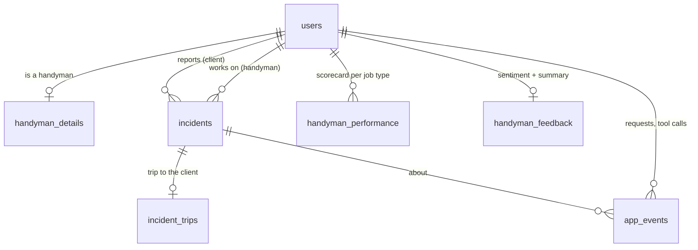

| Table | Holds | Key rules |
|---|---|---|
| `users` | every account, address, coordinates, `is_active` | unique email (case-insensitive), coordinates in range |
| `handyman_details` | specialisations and skills (`TEXT[]`), experience, CV path and text, car, rating, jobs, hourly rate | PK/FK `user_id`; trigger: must be a handyman; specialisations from a fixed list of 10 |
| `incidents` | description, type, urgency, required skills, status, handyman, recommendations + reasoning, rating, review, hours worked, amount paid, timestamps | lifecycle `open → recommended → assigned → in_progress → completed` (or `cancelled`); handyman required once assigned; nobody assigns themselves; timestamps in order; rating only on completed jobs; hours and amount both or neither, completed only; one open copy of the same problem per client |
| `incident_trips` | "I'm on my way": origin, travel mode, route, departure | one per incident; the client never sees the origin |
| `handyman_performance`, `handyman_feedback` | scorecards written by the pipelines, read by matching | PK (handyman, type); rates in range |
| `app_events` | agent requests, tool calls with arguments, API calls, UI actions, guardrail decisions | event type from a fixed set; feeds analytics through CDF |

Every row has `created_at`/`updated_at` (a trigger keeps `updated_at` current) and `REPLICA IDENTITY FULL` for Change
Data Feed. The app never deletes records: it changes status, `is_active` or upserts. Schema = base DDL in
[sqls/](sqls/) + 6 idempotent migrations, applied by `python sqls/migrate.py` (`--dry-run` rolls back).

---

## Spark pipelines: batch and real time

**Batch** (job `maintops_pipeline`, steps 10–16, logic in [pipeline_lib.py](pipeline/pipeline_lib.py)):

| Step | What it does |
|---|---|
| 10 Export raw | The 1M history as JSON, with realistic dirt injected deterministically: ~2 % fixable noise, ~2 % defects (duplicates, empty descriptions, invalid urgency, negative distances, unreadable dates, ratings of 7, negative hours, payments on unfinished jobs) |
| 11 Bronze | Auto Loader, every field as text, unexpected fields kept, source file recorded; checkpointed |
| 12 Silver | Types, repairs, **18 rules**; violations → `quarantine_incidents` with reason codes; MERGE with one row per incident (newer never overwritten by older) |
| 13 Gold performance | Per handyman × job type and overall: completed, cancelled, active, success rate, rating, resolution time, travel time, billed hours and amount, **hourly rate** |
| 14 Gold feedback | `ai_analyze_sentiment` (cached per distinct text), `ai_query` 25-word summaries for handymen with new reviews |
| 15 Sync | Upsert scorecards to Lakebase, keep `handyman_details` (jobs, rating, hourly rate) consistent |
| 16 Parse CVs | `ai_parse_document` over 10,000 PDFs, incremental |

**Real time** (job `maintops_live`, [20_live_stream](pipeline/20_live_stream.ipynb)): Structured Streaming on the
Lakebase CDF history table. Each micro-batch merges the changed incidents into silver, recomputes the scorecards of
only the affected handymen and pushes them to Lakebase first, then does the Delta bookkeeping and records the
latency. Checkpointed: a stopped stream catches up on everything when restarted. Started on demand (it runs compute
continuously).

**Measured:** [evidence/pipeline.md](evidence/pipeline.md), [evidence/latency.md](evidence/latency.md).

---

## Analytics pipeline

Lakeflow Declarative Pipeline `maintops_analytics` ([code](pipeline/analytics/maintops_analytics.py)), refreshed every
30 minutes by a job. Two streaming tables read the Lakebase CDF history incrementally (`analytics_events`,
`analytics_incident_changes`, with expectations that drop or count bad rows); nine materialized views answer:

| Table | Question |
|---|---|
| `analytics_agent_requests_hourly` | requests per hour and role, latency, tokens, estimated cost |
| `analytics_tool_usage` | calls, success rate and latency per tool |
| `analytics_write_actions` | writes by action, channel (agent / UI) and user |
| `analytics_api_usage_daily` | Geoapify calls, failures, p95 latency |
| `analytics_guardrails_daily` | emergencies, injections, figure corrections, rate limits |
| `analytics_feature_usage` | most-used features |
| `analytics_incident_activity_daily` | incident creation, updates and deletions per day and status |
| `analytics_recommendation_rank` | which of the three recommendations clients choose |
| `analytics_billing_monthly` | completed jobs, hours, amount paid and hourly rate per month and job type |

Output: [evidence/analytics.md](evidence/analytics.md).

---

## Third-party API: Geoapify

| Use | API | Where |
|---|---|---|
| Address → coordinates, region and country (sign-up, CV, profile) | Geocoding | `geo.geocode` |
| Travel time by car, many handymen in one request | Route Matrix | `geo.route_matrix` |
| Travel time by public transport (handymen without a car, or who choose it for a trip) | Routing, `approximated_transit` | `geo.transit_times`, 4 in parallel (free plan: 5 requests/s) |

Key from the environment or the `maintops` secret scope; retries with backoff on 429/5xx honouring `Retry-After`;
responses validated (coordinates, confidence, missing pairs); if routing fails, a straight-line estimate flagged
`estimated` (shown as "rough estimate"); every call logged with latency and errors. Unit-tested with mocked HTTP.

---

## Run it yourself

### The deployed app
https://maintops-h3bv.onrender.com (Render, auto-deploys every push to `main`). Settings in the Render dashboard:
`DATABRICKS_HOST`, `DATABRICKS_CLIENT_ID` + `DATABRICKS_CLIENT_SECRET` (service principal) or `DATABRICKS_TOKEN`, `DATABRICKS_WAREHOUSE_ID`, `FLASK_SECRET_KEY`, `GEOAPIFY_API_KEY`,
`LAKEBASE_PG_URL`, `MANNY_ENDPOINT` (`maintops-manny`); [render.yaml](render.yaml) documents them.

### Databricks access for the web app (for the workspace admin)

**Why this is needed.** The web app on Render calls three Databricks services: Manny's serving endpoint
(`maintops-manny`), the Files API (CV upload to a Volume) and a SQL warehouse (`ai_parse_document` on the CV). It
needs a Databricks credential for that. Student accounts in this workspace cannot create personal access tokens, and a
student's OAuth token expires after 1 hour, so today the student has to paste a new token into Render every hour, and
whenever it has expired Manny and CV upload answer "not available" (everything else keeps working). A service
principal is the standard credential for an application: it is not tied to a person, it can be given only the
permissions the app needs, and the app (`maintops_core/dbx_auth.py`) uses its client ID and secret to fetch and renew
its own token, so nothing ever has to be pasted again.

**Option 1, recommended (about 10 minutes, permanent): a service principal for the app**
1. Settings → Identity and access → Service principals → **Add service principal**, e.g. `maintops-app`.
2. On the service principal: **Secrets → Generate secret**; note the client ID and the secret (shown once).
3. Give it only what the app uses:
   - Serving → `maintops-manny` → Permissions → the service principal → **Can Query**
   - SQL Warehouses → warehouse `b15d3d6f837ba428` → Permissions → **Can use**
   - Unity Catalog (SQL editor, use the service principal's application ID):
     ```sql
     GRANT USE CATALOG ON CATALOG bootcamp_students TO `<application-id>`;
     GRANT USE SCHEMA ON SCHEMA bootcamp_students.maintops TO `<application-id>`;
     GRANT READ VOLUME, WRITE VOLUME ON VOLUME bootcamp_students.maintops.maintops_docs TO `<application-id>`;
     ```
4. Send the client ID and secret to the student privately. They go into the Render environment as
   `DATABRICKS_CLIENT_ID` and `DATABRICKS_CLIENT_SECRET`; no code change or redeploy of Manny is needed.

**Option 2, quick (2 minutes, for the grading session): an 8-hour token**

```bash
# needs CAN QUERY on maintops-manny; or: Settings → Developer → Access tokens → Generate new token
databricks tokens create --lifetime-seconds 28800 --comment "MaintOps assessment" -p <profile>
# Render dashboard → service "maintops" → Environment → DATABRICKS_TOKEN = <token_value> → Save (redeploys in ~1 min)
```

A 1-hour token from any account with access also works: `databricks auth token --force-refresh -p <profile>` (field
`access_token`).

**Please keep `maintops-manny` running until grading ends.** It was stopped once (29 September), and the deployed
app then cannot reach Manny. It runs on one small CPU replica without scale-to-zero, so the first request is not
delayed by a cold start. An automatic restart was deliberately not built: whether an endpoint an admin stopped should
run again is the admin's decision.

### Locally
```bash
python3.12 -m venv .venv && source .venv/bin/activate
pip install -r requirements.txt
cp .env.example .env            # fill in the 7 settings
set -a; . ./.env; set +a
flask --app app run --debug     # http://127.0.0.1:5000
.venv/bin/python -m pytest -q   # 281 unit tests, no network or database
uvx ruff check .                # lint
```

### Databricks side
```bash
databricks bundle deploy -p <profile>                                  # every job and the analytics pipeline
databricks bundle run maintops_pipeline -p <profile>                   # batch pipeline (--params force=true rebuilds)
databricks bundle run maintops_live --params max_minutes=480 -p <profile> --no-wait   # live stream for 8 h
databricks bundle run maintops_manny_deploy -p <profile>               # new Manny version through the release gate
python sqls/migrate.py --dry-run                                       # schema migrations (then without --dry-run)
python evidence/export_evidence.py                                     # regenerate evidence/*.md
```

Jobs in [databricks.yml](databricks.yml): `maintops_rag` (FAQ index), `maintops_synth` (synthetic data and Lakebase
load), `maintops_pipeline`, `maintops_live`, `maintops_manny_deploy`, `maintops_analytics_refresh` (every 30 min),
`maintops_vs_keepalive` (every 4 h).

---

## Full manual test walkthrough

Start the live stream first if you want to see scorecards and hourly rates update (command above). Password for every
account: `MaintOps!2026`.

1. **Visitor:** ask Manny "How do I report a problem?" (answer from the guide) and "How much does MaintOps cost?" (says
   pricing is not defined; invents no prices).
2. **Handyman sign-up with a CV:** upload [samples/cv_100001.pdf](samples/cv_100001.pdf) → Klaus Wolf, +49 179 5812847, Krefelder Weg 16, 22419
   Hamburg, region Hamburg, Germany, heating/HVAC, plumbing, electrical. Change the email and submit.
3. **Client `thomaskoch37@example.com`:** "My kitchen tap is leaking" → 3 cards → Choose → confirm → assigned, list
   updates live. Cancel it → confirm → cancelled.
4. **Handyman `ute.wisniewski15@example.net`, job #981034:** I'm on my way by public transport, then by car (shorter);
   another address "Alexanderplatz 1, 10178 Berlin". As `sergejhartmann66@example.com` the job shows the expected
   arrival, never Ute's starting point. Back as Ute: Start job; Mark completed with 1 h and €500 → refused ("€500.00 per
   hour; rates between €10 and €300…"); with 2.5 h and €135 → confirmation shows €54.00 per hour → completed.
   `nina.mayer79@example.org` (no car): I'm on my way offers public transport only.
5. **Ratings:** Sergej rates #981034. `bernd.wolf@example.net`: "Rate job 744760 5 stars" → "Yes, but make it 3 stars"
   → Manny asks again → "Yes" → 3 stars.
6. **Handyman insights (Ute):** "Worst feedback" → list + recurring complaint; "My weakest side" → job type + one tip.
7. **Completing through Manny (Nina, #632296):** "Job 632296 is finished." → asks for hours and amount → "I worked 3
   hours at my usual rate." → asks for the amount instead of working one out → "The client paid €210." → confirmation →
   "Yes." → shows 3 h · €210.00.
8. **Errors:** wrong password; ask about someone else's incident ("not found"); an expired token makes Manny say "not
   available" (see [Databricks access](#databricks-access-for-the-web-app-for-the-workspace-admin)).

---

## Repository layout

```
app.py                  Flask app: routes, auth, /api/manny proxy, dashboards, CV upload, trips
maintops_core/          services shared by the app and Manny
  incidents.py          incident lifecycle: ownership, transitions, billing validation
  matching.py           find_handymen: filter → nearest 20 → score → travel only where it matters → top 3
  geo.py                Geoapify: geocoding, route matrix, public transport; retries, validation, fallback
  trips.py              "I'm on my way": origin, travel mode, ETA
  grounding.py          runtime check that a handyman's figures are their own
  rag.py, events.py, db.py   FAQ search, app_events logging, connection pool
agent/                  manny.py (the agent) and deploy_manny.ipynb (register → staging → gate → production)
eval/                   release gate: runner, 71 scenarios, deterministic checks, test-account fixtures
pipeline/               Spark batch 10–16, live stream 20, latency test, analytics/ (Declarative Pipeline)
rag/                    FAQ retrieval: parse → chunk + index → retrieval eval; vector-index keep-alive
data_synthesis/         synthetic data (01–06), Lakebase load (07), billing backfill (08)
sqls/                   base DDL + migrations/ (migrate.py)
evidence/               exported measurements + export_evidence.py
docs/screenshots/       screenshots of the app (README "The app in pictures")
samples/                a synthetic CV for trying the CV sign-up
tests/                  281 unit tests (pytest)
templates/, static/     Jinja templates (dashboards, chat widget) and one stylesheet
databricks.yml          Asset Bundle: all jobs and the analytics pipeline
render.yaml, .env.example, pyproject.toml, requirements*.txt
```

---

## Known limitations and future work

- **Manny on Render needs a Databricks credential**: until the admin provides a service principal, a student can only set 1-hour tokens (see [Databricks access](#databricks-access-for-the-web-app-for-the-workspace-admin)).
- **Render free instance** sleeps when idle (first request up to 50 s).
- **The live stream runs on demand** to save the workspace owner's compute; while stopped, ratings and completed jobs
  are saved and the scorecards catch up when it restarts.
- **Shared limits:** the LLM's tokens-per-minute limit is shared with other students, and Lakebase autoscales between
  0.5 and 2 CU; many simultaneous conversations slow Manny down (it retries and then says it is busy).
- **Hours and amounts are the handyman's word**; the client sees them but does not confirm them.
- **Not built:** payment processing, booking a time slot, messaging, coverage outside Germany.

**Next: handymen accept assignments.** Today the client's choice assigns the handyman at once. Next, an incident would
count as assigned only once the handyman accepts it: status `awaiting_acceptance` with a deadline (e.g. 2 h urgent,
24 h otherwise); on decline or timeout it returns to `recommended`, `find_handymen` reruns without those who declined,
and the client is notified and chooses again, until someone accepts. A table `assignment_offers` (incident, handyman,
offered, response, responded) keeps the history and gives an acceptance rate that could also count in matching.

---

## Appendix: design specification

The original design, kept as the reference for how the system is meant to behave.

### Storage principles
**Lakebase is the operational store** (current users, handymen, open incidents, assignments, workload, events).
**Unity Catalog / Delta is the historical and analytical store** (the 1M history, derived features, analytics, raw
files). **Change Data Feed connects them:** Lakebase stays authoritative for current state; the history is never
loaded into Lakebase just to show volume, and completed incidents are not deleted from Lakebase because CDF copied
them.

### Specialisations, skills and experience
Specialisations are a controlled vocabulary of 10 (`plumbing`, `electrical`, `heating_hvac`, `carpentry`, `painting`,
`roofing`, `flooring`, `appliance_repair`, `locksmith`, `general_maintenance`) used for coarse filtering; CV extraction
must choose from it. Skills are granular abilities used for job compatibility; the experience summary is CV-derived
text. Both lists are `TEXT[]` on `handyman_details`.

### Authentication and authorization
Only an Argon2id `password_hash` is stored and verified with the library; passwords are never logged. Clients see only
their own incidents, handymen only the jobs assigned to them; the agent's identity comes from the server session.

### Handyman availability
Derived from active incidents (`assigned`, `in_progress`), never stored as a flag: fewer active jobs rank higher, 3 or
more excludes the handyman.

### CV upload and processing
Synchronous and separate from Spark, since a handyman expects a usable profile right away: the file goes to a Unity
Catalog Volume, `ai_parse_document` reads it, Manny (`extract_cv`) extracts the profile and address, geocoding adds the
region and country, and the result is saved on sign-up. Parsing and extraction are separate steps.

### Synthetic data
`data_synthesis/` generates 100,000 clients, 10,000 handymen with PDF CVs and 1,000,000 incidents with realistic
addresses (OpenStreetMap), skills, ratings, reviews and billing, all from `00_config`, with PASS/FAIL validation (`06`)
and a Lakebase load of the recent slice (`07`). Emails use reserved `example.*` domains; all accounts share the demo
password. Notebooks also run locally through Databricks Connect (`requirements-notebooks.txt`).

### Responsibility boundaries
| Component | Use for | Not for |
|---|---|---|
| LLM / agent | understanding descriptions, type, urgency, skills, choosing tools, explanations | scores, distances, prices, scanning history |
| Deterministic code | filtering, workload, distances, Geoapify, ranking, writes, authentication, authorization | |
| Spark | history: cleaning, aggregation, features, CDF into Delta, analytics | a single CV upload |
| Lakebase | current state, transactional writes | the 1M history |
| Delta / Unity Catalog | history, features, analytics, raw files | |

### Implementation rules
1. Keep the core operational model to `users`, `handyman_details` and `incidents`; supporting tables (trips, events,
   scorecards) are added only where a feature needs them.
2. Specialisations and skills are arrays on `handyman_details`, specialisations from the controlled vocabulary.
3. Never store or log plaintext passwords or secrets; credentials only in environment variables or secret scopes.
4. Geocode on registration or address change and persist the coordinates.
5. Derive availability from active incidents.
6. Filter by specialisation, skills and workload before any routing call; pre-filter geographically; fetch travel
   times only for candidates who can still reach the top 3, and batch car routes in one Route Matrix request.
7. Travel time is a ranking feature, not the dominant criterion.
8. Ranking is deterministic code; the agent never invents operational facts.
9. The client makes the final choice among the recommended handymen.
10. Current state in Lakebase, history and analytics in Delta; propagate changes through CDF.
11. Use Spark only where the volume justifies it.
12. Parameterise all database access; enforce authorization in the backend.
